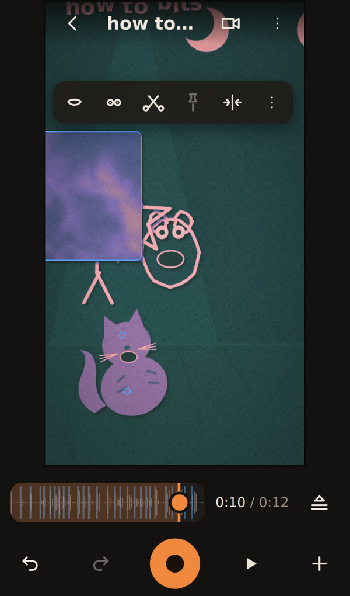

# BITS

A web app for making paper-cutout puppet shows on a phone, performed in layers over a recorded sound and exported as a video. Puppets come from photos, selfies, drawings, words and video clips, and a spring simulation makes every drag lag, lean and settle like paper on a stick. A camera, cuts, lighting, palettes and wires that let the sound move anything turn a single stage into a small film studio. Written in TypeScript and React, it runs entirely in the browser, with no server.

**Status: shipping.** It has had little time in real use so far, no iPhone has run it, and edits made on two phones never merge.

Live: https://ampactor.dev/bits/



## Quick start

You need Node.js and npm. CI uses Node 24.

```sh
npm install
npm run dev
```

`npm run dev` first stages MediaPipe, Google's on-device vision library, in `public/mediapipe/`: it copies the runtime out of `node_modules` and downloads two models the first time. Then it serves the app at http://localhost:5173/bits/. Open that address in Chrome. On first launch the app builds a 12-second demo bit (the app's word for a show) on the device and opens it. Press play to watch it, then tap a puppet and change it.

Browsers allow the camera, the microphone and on-device storage only on HTTPS or localhost, so a phone reaching the dev server over plain HTTP cannot save a bit. Use the live site to try BITS on a phone.

## Usage

Every bit starts with its sound: record it, or pick an audio or video file. Then:

1. **Cast.** The **+** button adds a sheet (the studio's word for a puppet): a photo cut out by MediaPipe, a selfie kit (a body with a head that rides it), a drawing, a word, a sticker, a video clip, a backdrop or an ink grown in the seed tray.
2. **Dress it.** Tap a sheet for its toolbar: a mouth, googly eyes that blink, scissors, pins, a flip, and **more**, which holds its size, depth, spring, ink, what it rides on, how each cut moves (swings, bent or folded over) and its wires.
3. **Perform.** Press record and drag. Each drag becomes a pass that replays while you record the next, like overdubbing tracks. Each finger records its own pass. The camera button turns a finger into the camera: one finger pans, two fingers push in and roll, and **cut** snaps back to the wide shot, on the beat when one is near.
4. **Edit.** **The passes** shows a lane per sheet to mute, trim or loop. The **shots** room lays the film out as cards between cuts: frame each one wide, close on a sheet or with everyone in, and slide its cut a beat either way.
5. **Look and wire.** The **this bit** menu (⋮) sets shadows, fog, a five-colour palette and a paper grain for the whole film. Its **stage wires** room, and each sheet's own, connect signals (the voice, the beat, bass, a slow wave, a clip's motion) to targets (size, turn, depth, colour, folds, the camera).
6. **Share.** The same menu renders an MP4 or sends the bit itself as a `.bit.json` file that opens as a working show on another phone.

On a keyboard, space plays and stops, the arrow keys scrub, and Escape backs out of whatever is open.

## How it works

Every change to a show appends an event to its recipe, an append-only log defined in `src/engine/recipe.ts`. There are 18 kinds of event, from CAST and PASS to CUT, INK and FOLD. Undo takes the newest event off the end, and removing anything appends an event that points at it. The format is at version 11, and each version has a migration, so a bit saved by any earlier build still opens and draws the same. Recipes and their assets live in OPFS (the Origin Private File System), the private file storage a browser gives each website.

The simulator in `src/engine/show.ts` replays the recipe on a fixed grid of 1/120 s steps. Each sheet chases the newest pass covering the moment through a damped spring, which gives the lag, lean, squash and settle. A sheet that rides another (a head on a body) is stepped after its parent and springs toward its anchor on it. The camera is one more body in the same sim. The sim keeps a checkpoint every second, so seeking rebuilds from the nearest one. Nothing in it reads the clock or `Math.random`: randomness comes from the bit's seed, so a show plays the same on every device.

One function, `composeFrame` in `src/engine/frame.ts`, turns the sim's state into a frame: layers in depth order, mouths, wire effects, the camera and the look. The live preview, the exported film, the list's posters and the tests all draw through it. Two renderers then draw a frame. The Canvas2D renderer is the reference, and the WebGL2 renderer (`src/render/gl/`) draws each sheet to a sprite with the same rasteriser and composites the stage on the GPU. The app picks WebGL2 on a hardware GPU and Canvas2D on a software one, and a test holds the two to the same pixels.

Wires connect signals to targets (`src/engine/signals.ts`, `src/engine/props.ts`). Signals that depend only on time, such as the beat or a smoothed bass band, are computed ahead on the 120 Hz grid, so a smoothed wire looks the same whichever frames the preview happens to draw. Bands come from a worker that decodes the sound at its own rate. A video clip is read once on import for its motion, its drift, a person mask per frame and head and wrist tracks, and the read is stored as an asset because model output differs between devices.

All media work happens on the device. [Mediabunny](https://mediabunny.dev/) decodes sound and video and writes the film through WebCodecs, the browser's built-in encoders. [MediaPipe](https://ai.google.dev/edge/mediapipe/solutions/guide) cuts people out of photos and clips and tracks poses. The models only cut out and track. Nothing on the stage is generated, nothing is uploaded, and there are no accounts. [docs/VISION.md](docs/VISION.md) describes where the studio is going, and [docs/studio/PLAN.md](docs/studio/PLAN.md) records each milestone: what shipped, what moved and why.

## Project layout

```text
src/engine/     recipe, simulation, camera, frame builder, signals, wires, inks, shots, kits, folds
src/media/      OPFS store, decode and import, cutouts, pose, video read, stage drawing, render
src/render/     the WebGL2 renderer and the choice between it and Canvas2D
src/ui/         the bits list, the stage and its sheets, and the Wires, Shots and seed-tray rooms
src/kit/        shared UI parts: design tokens, icons, buttons, sheets, toasts
src/e2e/        in-browser test hooks, loaded only with ?e2e, and the frozen legacy renderer
tools/          model staging, the browser test suites in tools/e2e/, the device checklist
docs/           the vision, the studio plan, and the UX audit
```

## Deploy

[`.github/workflows/deploy.yml`](.github/workflows/deploy.yml) runs on every push to `main`, every pull request and on manual runs. It installs with `npm ci` on Node 24, then runs lint, the unit tests, the build, the budget check and both browser suites. When they all pass on `main`, it publishes `dist/` to GitHub Pages, which serves https://ampactor.dev/bits/. Pull requests run the same checks and never deploy. The service worker carries a hash of the build's file list, so returning visitors and installed copies get each new build with a reload prompt.

## Testing

```sh
npm test              # unit tests (Vitest)
npm run lint          # ESLint over src/
npm run build         # stages MediaPipe, typechecks, builds dist/
npm run test:budget   # needs dist/
npm run test:e2e      # the render proof; needs dist/ and Chrome
npm run test:ux       # the walkthrough; needs dist/ and Chrome
```

- `npm test` runs 264 tests in 26 files: the recipe and every migration, the simulation and its checkpoints, the camera, signals and wires, inks, shots, kits, folds and the frame builder, plus the stage's hit testing and the shared UI parts in jsdom.
- `npm run test:budget` adds up the gzipped size of every script the page loads before first paint: 248.4 KB against a 450 KB budget at commit `2612961`.
- `npm run test:e2e` is the render proof, 46 checks in headless Chrome. It renders a show through the production pipeline and probes the MP4, draws a fixed-seed fixture through the frame builder and through a frozen copy of the pre-studio renderer for 120 frames and requires them to match byte for byte, checks the WebGL2 renderer against Canvas2D on five scenes, and checks the camera, shadows, fog, folds, video frames, the clip read (with the real models, offline) and a stored v0 bit.
- `npm run test:ux` walks the app on an emulated iPhone 14 with a fake camera and microphone and makes 106 checks: how much of the stage each overlay covers, text size, accessible names, the events each gesture records, and frame time at four times CPU throttling (33.4 ms median in my last local run). It writes screenshots to `UX_SHOTS_DIR`.

CI runs all six on every push and pull request with Google Chrome. Both browser suites need a Chrome with an H.264 encoder. Playwright's Chromium has none, so locally I use Chrome for Testing and point `PUPPETEER_EXECUTABLE_PATH` at it. The suites never touch real hardware: a real camera, the share sheet and installing the app are untested, and [tools/smoke-checklist.md](tools/smoke-checklist.md), the manual pass for phones, predates the studio.

## Limitations

BITS never merges edits made on different phones. If two people change the same show on their own phones, they end up with two separate shows. This is deliberate: there is no server, so a show moves between people when they pass the phone or send its file. Its recipe is an append-only log of edits, which would make a merge feature possible later if one proves worth building.

- No iPhone has run BITS, so Safari support is unknown. The code relies on OPFS writable streams, WebCodecs H.264 encoding and MediaRecorder.
- Making a film needs a browser that can encode H.264 through WebCodecs. Films come in one size: 720x1280 at 30 frames per second, or 1280x720 for wide bits.
- The first cutout downloads about 12 MB of MediaPipe runtime and model, and pose tracking a further 5.8 MB (sizes from `dist/mediapipe` after a build). Offline before that, a photo is kept whole.
- Reading a clip runs on the main thread with a progress bar, so the stage is busy while it reads.
- Folds are drawn flat: a bent flap squashes across its fold line without perspective. True 3D folds would need the WebGL2 renderer alone, and the two renderers are held to the same pixels.
- Mouth shapes follow the loudness and hiss of the sound, so they approximate speech without recognising words.
- Bits live only in the browser's storage on one phone. Clearing the site's data deletes them, and a bit file is the only backup.

## Roadmap

- Run BITS on an iPhone and fix what breaks. It waits on access to a device.
- Perspective folds and paper tunnels to fly the camera through. They need a WebGL2-only mode with its own render proof, because Canvas2D cannot draw perspective.
- Eyes that follow another sheet. The likely shape is a wire to an eye target, which waits on a signal that names a sheet's position relative to another.

## License

No license chosen yet.
