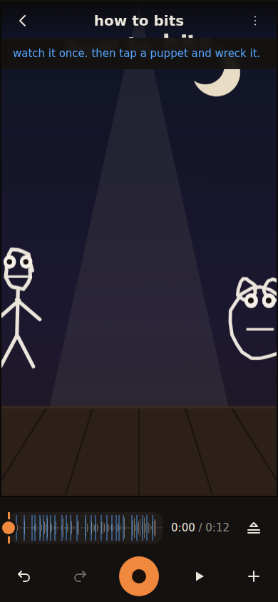

# BITS

A puppet-show instrument for phones that runs in the browser: record the
sound, then perform puppets over it one pass at a time. Each pass is one
finger dragging one puppet while the audio and earlier passes play back, like
overdubbing tracks. Puppets come from photos cut out on the phone or from
finger doodles, and springs add lag, lean, squash and settle. It is built with
TypeScript, React, Mediabunny, WebCodecs and MediaPipe, and all processing and
storage stay on the phone.

**Status: shipping.** It has been checked on real phones in Chrome only, and no iPhone has run it yet.

Live: https://ampactor.dev/bits/



## Quick start

CI builds with Node 24. The commands below also run on Node 22.

```sh
npm ci
npm run dev
```

Open http://localhost:5173/bits/. Before Vite starts, `npm run dev` runs
`tools/fetch-assets.mjs`. It copies the MediaPipe wasm from `node_modules`
into `public/mediapipe/` and downloads two models from Google's model storage
(0.25 MB for cutouts, 5.8 MB for pose). If a download fails, photo cutouts
fall back to the whole frame and body passes are unavailable.

On first launch the app builds a demo bit called "how to bits" and opens its
stage. Press play to watch it, then tap a puppet to see its tools. The back
arrow leads to the bits list, where "+ new bit" starts your own.

## Usage

A bit is one show: its sound, its cast of puppets and every pass performed
over them. Making one goes like this:

1. Record the sound from the mic (up to 100 seconds) or pick an audio or
   video file. An audio-only file is kept byte for byte. A video's sound is
   decoded and re-encoded.
2. Cast puppets with the + button: a photo, a selfie, a doodle, a word, a
   sticker or a backdrop. Drag a puppet to place it. Two fingers resize and
   rotate it. Tap a puppet for its tools.
3. Press record, drag a puppet while the sound and earlier passes play, then
   stop. Two click beats count you in. Recording starts at the playhead, so a
   pass can punch in anywhere. Repeat for the next puppet.
4. Make a film from the bit's menu and send the mp4 through the share sheet.

Undo steps back one change and redo brings it back. The lanes panel draws
each pass as a span on the timeline, where you can mute, solo, trim or delete
it. The bit's menu also switches the stage between tall (9:16) and wide
(16:9).

A selected puppet's tools are snip, mouth, eyes, pin, flip and more. A snip
splits a puppet along a drawn line, and the piece dangles from the cut like a
paper-doll joint. A mouth flaps with the voice track. Once a puppet has
passes, it talks only while one of them covers the moment, so holding a
puppet is how you say who is speaking (the talker rule). Wires make a puppet
bounce, shake or lean with the voice, or bounce and shake on the beat. A body
pass lets your wrists drive puppets through the front camera. [docs/USAGE.md](docs/USAGE.md)
describes every tool.

### Collaboration

There is no server, so people collaborate by sharing a phone or a file. On
one phone, players take turns performing passes, and blind recording hides
the earlier passes until playback. Across phones, "send the bit" exports a
`.bit.json` file with the recipe and every asset. The receiver opens it from
the bits list or the share sheet as the full working show, ready to
re-perform. [docs/USAGE.md](docs/USAGE.md#collaboration) has the details.

## How it works

Everything a show is lives in the recipe (`src/engine/recipe.ts`): an
append-only log of events such as CAST, PASS, SNIP, MOUTH, PIN and WIRE,
saved as one JSON file per bit. Undo pops the last event and redo puts it
back. Removing a feature appends a REMOVE event instead of rewriting history.

The show simulator (`src/engine/show.ts`) turns the recipe into motion. For
each puppet, the newest pass covering a moment supplies the target, and a
spring pulls the puppet toward it on a fixed grid of 1/120-second steps
(`src/engine/puppet.ts`). Every advance schedule runs the same steps, so the
same recipe always simulates to the same frames. A unit test checks that
split advance schedules stay bit-exact.

One drawer (`src/media/stageDraw.ts`) paints both the live preview and the
film, so the film shows what was performed. The preview clock follows the
AudioContext, so mouths move on the audio's time. The render
(`src/media/render.ts`) steps the show frame by frame and encodes an H.264
mp4 with Mediabunny, which uses WebCodecs (the browser's video encode and
decode API). Films are 720 by 1280 for a tall stage and 1280 by 720 for a
wide one, at 30 frames per second.

Mouths use spectral visemes: every 20 ms, loudness and zero-crossing rate
(how often the waveform crosses zero, high for hissy sounds like s and sh)
pick one of five mouth shapes. Pins bend a photo with moving-least-squares
similarity deformation, a closed-form warp that keeps each small region
close to rigid. Bits and assets live in OPFS, the Origin Private File System,
a per-site file store inside the browser. A bit file is the recipe plus every
asset it references, base64-encoded. [docs/DESIGN.md](docs/DESIGN.md) covers
these in depth, along with snips, cutouts, body passes, the service worker
and the colour rule.

## Project layout

```
src/engine/     recipe model, undo history, onsets, springs, pieces, warp, wires, sfx, show sim
src/media/      OPFS and assets, Mediabunny decode, mic, cutouts, pose, bundle, poster, render
src/ui/         React UI: the bits list and the stage
src/kit/        shared controls and design tokens
src/demo/       first-run demo bit, synthesized on the device
src/pwa/        service worker registration and install prompt
src/e2e/        in-browser test harness, loaded with ?e2e
public/sw.js    precache service worker
tools/          asset staging, browser test drivers, device checklist
docs/ux-audit/  the UX audit and the plan that followed it
```

## Deploy

The app is a static site on GitHub Pages at https://ampactor.dev/bits/ (Vite's
`base` is `/bits/`). `.github/workflows/deploy.yml` runs on every push to
`main`, on every pull request and on manual dispatch. It installs with
`npm ci` on Node 24, then runs lint, the unit tests, the build, the payload
budget, the render proof and the UX walkthrough. Only a run on `main`
uploads `dist/` and deploys it, so the live site passed every check on the
commit that shipped it.

## Testing

```sh
npm test             # unit tests (Vitest)
npm run lint         # ESLint over src/
npm run build        # stage assets, typecheck, production build to dist/
npm run test:budget  # gzipped size of the scripts loaded before first paint
npm run test:e2e     # render proof in headless Chrome
npm run test:ux      # phone walkthrough in headless Chrome
```

`npm test` runs 165 tests in 11 files: the engine, media helpers and stage
state machine in Node, and the UI kit in jsdom. They cover the springs, pass
targeting, talk spans, snips, the voice track, the warp, wires, foley, recipe
parsing and migration, undo and redo, onsets, bit-file asset mapping and hit
testing. `npm run test:budget` fails above 450 KB; on this commit the eager
scripts are 213.8 KB gzipped.

The render proof (`tools/e2e/render-proof.mjs`) serves the production build
with `?e2e`, synthesizes a two-second track, casts a snipped and mouthed
puppet, replays a scripted pass, renders it and probes the mp4. It also
round-trips a bit file, checks that flip mirrors the pixels and renders a
stored v0 bit. It needs a Chrome build with an H.264 encoder. The UX
walkthrough (`tools/e2e/ux-walk.mjs`) drives the real app on an emulated
iPhone 14 screen with a fake mic and camera, and runs 81 checks drawn from
the UX audit, including frame time at 4x CPU throttle. Both look for Chrome
at `/usr/bin/google-chrome`; set `PUPPETEER_EXECUTABLE_PATH` to use another.

CI runs all six commands. No automated test checks the quality of photo
cutouts or runs a body pass. Real phones are a manual pass with
`tools/smoke-checklist.md`, which predates the UX rework and still refers to
the old kit panel.

## Limitations

BITS has been checked on real phones in Chrome only, and no iPhone has run
it. Safari support is unverified: the app depends on browser APIs for file
storage, H.264 video encoding and audio recording that have not been tried
there. Nothing merges between phones. Two people editing copies of one bit
end up with two bits, and sharing means passing the phone or sending the
file.

- Making a film needs a WebCodecs H.264 encoder. Without one the render
  stops with "this device cannot encode H264 video".
- A mic take stops at 100 seconds.
- Mouth shapes follow the character of the sound. They do not recognise
  words or phonemes.
- The cutout model looks for people. A photo with no person in it keeps its
  whole frame as a rectangle.
- The first photo cutout downloads 11.8 MB and the first body pass 5.8 MB.
  Body passes need that download before they work offline.
- Opening a bit from the share sheet needs an installed copy in a browser
  that supports web share targets. Elsewhere, "open a bit file" is the way
  in.
- Merging could be built on the append-only recipe later. It has not been.

## Roadmap

- Run it on an iPhone and fix what breaks, or name Android Chrome as the
  supported platform on the site. This is the one item still open in the UX
  audit ([docs/ux-audit/README.md](docs/ux-audit/README.md)), and it waits
  on access to an iPhone.

## License

No license chosen yet.
