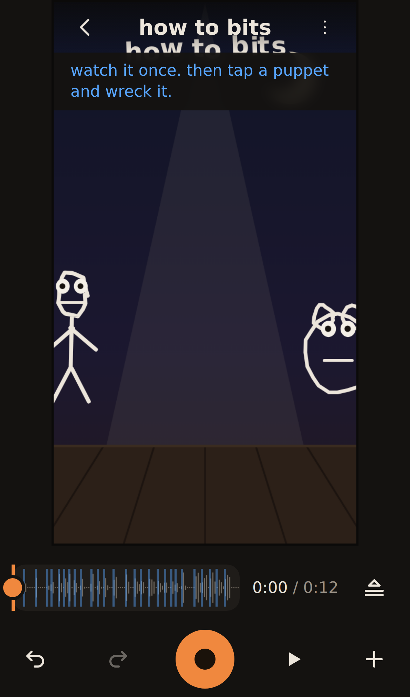

# BITS

A web app for making puppet shows on a phone: record the sound, turn photos into puppets, animate them by dragging in layers, and export a video. Each layer is a pass: you drag a puppet while the sound and earlier passes play, like a musician recording one track over another. A spring simulation makes each dragged puppet lag, lean, squash and settle, and puppets' mouths flap with the voices. Written in TypeScript and React, it runs entirely in the browser, with no server.

**Status: shipping.** It has had little time in real use so far, and by design, edits made on two phones never merge.

Live: https://ampactor.dev/bits/



## Quick start

You need Node.js and npm. CI uses Node 24; I checked these steps on Node 22.

```sh
npm install
npm run dev
```

`npm run dev` first stages MediaPipe, Google's on-device vision library, in `public/mediapipe/`: it copies the runtime out of `node_modules` and downloads two models (about 6 MB, only the first time). Then it serves the app at http://localhost:5173/bits/. Open that address in Chrome. On first launch the app builds a 12-second demo bit (the app's word for a show) on the device and opens it. Press play to watch it, then tap a puppet and change it.

Browsers allow the camera, the microphone and on-device storage only on HTTPS or localhost. A phone that reaches the dev server over plain HTTP (with `npm run dev -- --host`) therefore cannot save a bit or use the microphone, so open the live site to try BITS on a phone.

## Usage

Every bit starts with its sound. Tap **+ new bit**, then record with the microphone or pick an audio or video file; from a video, BITS keeps only the audio. A recording stops at 100 seconds. The rest of a session goes like this:

1. Add puppets with the **+** button in the dock, the row of buttons under the stage: a photo from the camera roll, a selfie, a drawing, a word, a backdrop or a sticker. MediaPipe cuts the person out of a photo, and when it finds no person it keeps the whole photo and says so.
2. Tap a puppet to select it. Its toolbar adds a mouth or googly eyes, cuts it with scissors, pins it, flips it, or opens **more**. That sheet holds its name, size, spring (how floppy it is), wires (links from the sound to its motion), its own voice take, its layer and the hand that drives it. Drag to move a puppet, and pinch with two fingers to resize and rotate it. To remove a mouth, eyes or a pin, drag it off the puppet.
3. Press record. Two clicks count you in, the sound plays, and every drag becomes a pass. Each finger records its own pass, so two people can perform at once. Earlier passes replay while you record, and recording starts at the playhead, so you can punch in anywhere.
4. Tap **the passes** beside the timeline to see a lane for each puppet that has passes. Tap a pass to mute it or take it out, drag its ends to trim it, tap a lane's name to hear only that puppet, or drag along the time axis to loop a stretch while you practise.
5. Open the **this bit** menu (⋮) to make a film and share the MP4, or to send the bit itself as a file. The same menu starts perform mode (the stage alone, full screen), trims or re-records the sound, and switches the stage between tall and wide. It also turns on blind recording (the earlier passes stay hidden while you record), trails behind moving puppets, and impact foley, a sound effect whenever a puppet lands hard.

On a keyboard, space plays and stops, the arrow keys scrub by a tenth of a second (a second with Shift), and Escape backs out of whatever is open.

## How it works

Most changes to a show, from casting a puppet to recording a pass, append an event to the bit's recipe: an append-only log whose format lives in `src/engine/recipe.ts`. There are 14 kinds of event, covering casts, passes, snips, mouths, wires, removals and more. A few settings, such as the sound's trim and the stage's shape, are stored beside the log. Events are never edited in place. Removing a feature appends an event that points at it, and undo takes the newest event off the end. The app stores recipes and their assets in OPFS (the Origin Private File System), the private file storage a browser gives each website, and it migrates recipes saved in the first format (v0) when it loads them.

The show simulator in `src/engine/show.ts` replays the recipe. Each puppet chases the newest pass that covers the current moment through a damped spring, which gives the lag, a lean from horizontal speed, a squash from acceleration, and the settle after you let go. In hand-drawn animation an inbetweener draws the frames between key poses; here the spring does that job, so rough dragging reads as motion. The simulation moves in whole steps of 1/120 s on one global grid, so it reaches the same state however the steps are split up, and a unit test checks that. The live preview and the exported film draw every frame with the same function, `drawStage` in `src/media/stageDraw.ts`. During playback the preview takes its clock from the Web Audio context, so mouths move in time with what you hear.

All media work happens on the device. [Mediabunny](https://mediabunny.dev/), a JavaScript library for reading and writing media files, decodes the sound and writes the film through WebCodecs, the browser's built-in video and audio encoders and decoders. A film is an MP4 with H.264 video and AAC or Opus audio. [MediaPipe](https://ai.google.dev/edge/mediapipe/solutions/guide) runs a selfie-segmentation model to cut people out of photos and a pose model to track wrists. The models only cut out and track, and no model draws anything on the stage. Nothing is uploaded, and there are no accounts.

### Mouths and voices

A mouth on a puppet opens with the loudness of the sound and takes one of five shapes, each a rough viseme (the mouth shape that goes with a group of speech sounds). Every 20 ms, `src/engine/envelope.ts` measures the loudness, scaled against the track's own loud parts, and the zero-crossing rate, which rises with hissing sounds. From those two numbers it picks closed, small, wide, round, or a slit for sounds like s and sh. The shapes depend only on the audio samples, so preview and render agree.

The talker rule decides who speaks. A puppet with a mouth and no passes talks all the time; once it has passes, it talks only while one of them covers the moment, so holding a puppet is how you say who is speaking. A puppet can also get a voice take of its own, recorded separately, and then its mouth follows that take. Googly eyes lag behind the puppet's motion. Drawings and words boil: their lines jitter slightly eight times a second, the way hand-drawn lines shift from frame to frame.

### Snips and pins

A snip is a line drawn across a puppet. The part on the far side from the puppet's centre becomes a piece hinged at the line's midpoint, like a paper doll's limb. It dangles as the puppet moves, and you can grab the piece itself during a pass. Pins bend an uncut photo puppet instead. They are the control points of a moving-least-squares similarity warp (Schaefer et al., 2006), a closed-form deformation that keeps each small region of the image close to rigid, drawn as a textured triangle mesh. Each pin is a spring you can also grab in a pass. A puppet can have snips or pins, but never both.

### Wires, foley and body passes

Wires connect a signal to a puppet: the loudness of the voices can make it bounce, shake or lean, and the beat can make it bounce or shake. The beat comes from onsets, the moments where the sound's energy jumps, found by `src/engine/onsets.ts`. A stage-wide wire leaves trails behind moving puppets. The foley board holds five sound effects synthesized in `src/engine/sfx.ts`: boing, slap, honk, scratch and drop. It appears while you record, and each tap lands in the recipe at the playhead. Body passes use MediaPipe's pose model on the front camera: each wrist drives one puppet, and the app records the motion as ordinary passes.

### Collaboration

There is no server, so people collaborate by sharing the phone or by sending a file.

On one phone, a group records the sound together and then performs. Each finger records its own pass, and one person can tap the foley board while another drags. The talker rule turns hand-offs into dialogue, because whoever holds a puppet is the one speaking. Blind recording is the party game: each person performs without seeing the earlier passes, and everyone meets the whole show when the curtain goes up. Perform mode leaves only a record button and a way out on the screen, so two people have room for four hands.

Across phones, the unit is the bit file. The **send the bit** button packs the recipe and every asset it uses (the sound, photo cutouts and voice takes, base64-encoded) into one `.bit.json` file. The receiver opens it with **open a bit file** on the list, or on an installed copy straight from the phone's share sheet, and gets the working show with a credit to the bit it came from. Import copies every asset under a new id, so an imported bit shares no storage with any other. A bit whose file arrived without its sound still opens and asks for the sound again. Finished films leave as ordinary MP4 files through the share sheet, or as a download where sharing is not available. A copy made on the same phone shares its assets with the original, so deleting a bit removes only the assets that no other bit uses.

### Interface rules

Orange and blue are the only semantic colour pair (`src/kit/tokens.css`), so no state depends on telling red from green. Nothing that gives instructions is smaller than 15 px, and deleting a bit, a puppet, a pass or a feature shows an undo button for five seconds. The interface was rebuilt after a UX audit: [docs/ux-audit/README.md](docs/ux-audit/README.md) holds the audit and its before-and-after measurements, and [docs/ux-audit/PLAN.md](docs/ux-audit/PLAN.md) the plan it followed.

## Project layout

```text
src/engine/     recipe, show simulation, springs, snips, warp, wires, foley, voice envelope, onsets, waveform peaks, undo
src/media/      OPFS store, assets, bit files, audio decode and import, mic, cutouts, pose, list posters, stage drawing, render
src/ui/         React screens: the bits list, and the stage with its dock, puppet toolbar, timeline, lanes and sheets
src/kit/        shared UI parts: design tokens, icons, buttons, sheets, toasts, banners
src/demo/       the first-run demo bit, synthesized on the device
src/pwa/        service-worker registration and the install prompt
src/e2e/        in-browser test hooks, loaded only with ?e2e
public/sw.js    the service worker: precache, updates, share-target inbox
tools/          model staging, the browser tests in tools/e2e/, the device checklist
docs/ux-audit/  the UX audit, the plan that followed it, and its screenshots
```

## Deploy

[`.github/workflows/deploy.yml`](.github/workflows/deploy.yml) runs on every push to `main`, on every pull request, and on manual runs. It installs with `npm ci` on Node 24, then runs lint, the unit tests, the build, the budget check and both browser suites. When they all pass on `main`, it publishes `dist/` to GitHub Pages, which serves https://ampactor.dev/bits/. Pull requests run the same checks and never deploy. The build stamps a hash of its file list into the service worker (the script that lets the browser run the app offline), so returning visitors, installed copies included, get each new build with a reload prompt.

## Testing

```sh
npm test              # unit tests (Vitest)
npm run lint          # ESLint over src/
npm run build         # stages the MediaPipe files, typechecks, builds dist/
npm run test:budget   # needs dist/
npm run test:e2e      # needs dist/ and Chrome
npm run test:ux       # needs dist/ and Chrome
```

- `npm test` runs 165 tests in two Vitest projects. Of those, 156 run in Node and cover the engine (recipe parsing and v0 migration, the simulation, snips, warp, wires, foley, undo groups, onsets, waveform peaks), bit-file asset remapping, sound-file naming, and the stage's mode machine and hit testing. The other nine run in jsdom, a simulated browser page, and cover the shared toasts, banners, sheets, buttons and icons.
- `npm run test:budget` adds up the gzipped size of every script the page loads before first paint. At commit `d3737e2` the total is 213.8 KB against a 450 KB budget.
- `npm run test:e2e` is the render proof. It serves the build, opens it in headless Chrome with `?e2e`, and makes 18 checks: it synthesizes a two-second track, renders a show through the production pipeline and re-probes the MP4's length and size, round-trips a bit file through OPFS, checks that a flipped puppet mirrors its pixels, and opens and renders a stored v0 recipe.
- `npm run test:ux` walks the app in headless Chrome on an emulated iPhone 14 with a fake camera and microphone, and makes 81 checks. They measure how much of the stage an overlay covers, text size, accessible names, system dialogs, the events each gesture records, and frame time at four times CPU throttling. It writes screenshots and a measurement table to `dist-ux-shots/`, or to `UX_SHOTS_DIR` when that is set.

CI runs all six commands for every push and pull request, with Google Chrome for the browser suites. Locally, both browser suites look for Chrome at `/usr/bin/google-chrome`; set `PUPPETEER_EXECUTABLE_PATH` or `CHROME_PATH` to use another browser. The render proof also needs an H.264 encoder, which some Chromium builds lack. When I ran both browser suites with Playwright's Chromium 1194 for this README, the render proof stopped with "this device cannot encode H264 video". The walk passed 80 of its 81 checks there: the frame-time check measured a 50 ms median frame against its 34 ms limit, while the CI run on commit `d3737e2` measured 16.7 ms.

The automated suites never touch real hardware. Body passes, a cutout of a real person, the phone's share sheet and installing the app are untested. [tools/smoke-checklist.md](tools/smoke-checklist.md) is the manual pass for phones, but it predates the UX overhaul: it still describes the removed kit panel and a long press that drops a puppet, so parts of it no longer apply.

## Limitations

BITS never merges edits made on different phones. If two people change the same show on their own phones, they end up with two separate shows. This is deliberate: there is no server, so a show moves between people when they pass the phone or send its file. Its recipe is an append-only log of edits, which would make a merge feature possible later if one proves worth building.

- No iPhone has run BITS, so Safari support is unknown. The device checklist targets Chrome.
- Making a film needs a browser that can encode H.264 video through WebCodecs. Where it cannot, the film fails with "this device cannot encode H264 video".
- The first photo cutout downloads 11.8 MB of MediaPipe runtime and model, and body passes need a further 5.8 MB pose model (sizes from `ls -l dist/mediapipe` after a build). The service worker caches these files only after their first use, so the first cutout and the first body pass need a network connection. Offline, a photo is kept whole.
- Mouth shapes follow the loudness and hiss of the sound, so they approximate speech without recognising words.
- Films come in one size: 720x1280 at 30 frames per second, or 1280x720 for wide bits.
- Bits live only in the browser's storage on one phone. Clearing the site's data deletes them, and the browser may evict them if it refuses the app's request for persistent storage. A bit file is the only backup.

## Roadmap

- Run BITS on an iPhone and fix what breaks. It waits on access to a device. The code relies on OPFS writable streams, WebCodecs H.264 encoding and MediaRecorder, and none of them has been tried on an iPhone; [docs/ux-audit/PLAN.md](docs/ux-audit/PLAN.md) lists this as its one unscheduled item.

## License

No license chosen yet.
